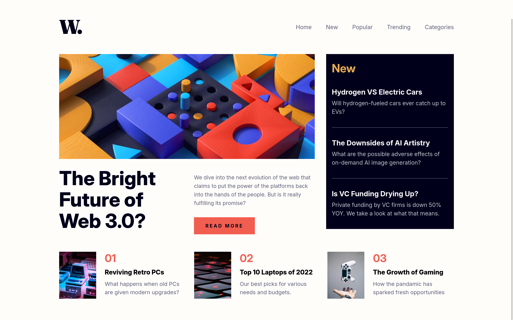

# Frontend Mentor - News homepage solution

This is a solution to the [News homepage challenge on Frontend Mentor](https://www.frontendmentor.io/challenges/news-homepage-H6SWTa1MFl). Frontend Mentor challenges help you improve your coding skills by building realistic projects. 

## Table of contents

- [Overview](#overview)
  - [The challenge](#the-challenge)
  - [Screenshot](#screenshot)
  - [Links](#links)
- [My process](#my-process)
  - [Built with](#built-with)
  - [What I learned](#what-i-learned)
- [Author](#author)

## Overview

### The challenge

Users should be able to:

- View the optimal layout for the interface depending on their device's screen size
- See hover and focus states for all interactive elements on the page

### Screenshot

### Links

- Solution URL: [Solution URL](www.frontendmentor.io/solutions/news-homepage-using-react-IuCsOjqRLS)
- Live Site URL: [live site](https://et-coder.github.io/news-homepage/)

## My process

### Built with

- Semantic HTML5 markup
- CSS custom properties
- Flexbox
- CSS Grid
- Mobile-first workflow
- [React](https://reactjs.org/) - JS library
- Tailwind css

### What I learned

In this challenge I learned how to use my knowlede of react and tailwindcss together to create the layout. I also sharpened my css grid skills using tailwind.

## Author

- Github - [Natnael](https://www.github.com/et-coder)
- Frontend Mentor - [@et-coder](https://www.frontendmentor.io/profile/et-coder)
